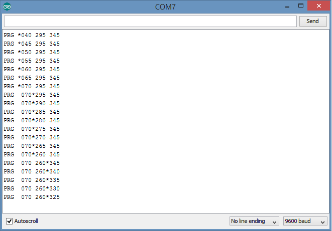

Buttons library
==============

This provides a library for setting up temporary switches (buttons) in a resistor ladder with one configuration given.  

# Adding the library to your sketch

To use the library place the Buttons directory in your Arduino>libraries directory the add includes:

```
#include <Buttons.h>
#include <EEPROM.h>
```

to your sketch. 

# Setting up the resistor ladder

Buttons.cpp includes a schematic:  

```
  Schematic:                         AD conversion
  analogPin                 +5 V      
     |                         |
     |                         \
     ----------------          /  
                    |          \  10K 
                    |          /
                    |          \  440 (expected 10 bit analogue read value)
                    |____ \____| 
                    |   INC    |         
                    |          \
                    |          /  
                    |          \  10K
                    |          /
                    |          \
                    |____ \____|  260 (expected 10 bit analogue read value)
                    |   DEC    |         
                    |          \
                    |          /  
                    |          \  10K
                    |          /
                    |          \
                    |____ \____|  160 (expected 10 bit analogue read value)
                    |   SEL    |
                    \          \
                    /          /  
                    \  10K     \  10K (pull down resistors)
                    /          /
                    \          \
                    |          |
                    |          |
                  _____      _____  
                   ___        ___     ground
                    _          _
```

One a breadboard this would look similar to:  


Once all is hooked up, upload the sketch and open a Serial Monitor. Nodes may be selected and values changed, using the three button configuration:  



The asterisk denotes the selected node, which enables value changes for the node with the INC/DEC buttons.  
